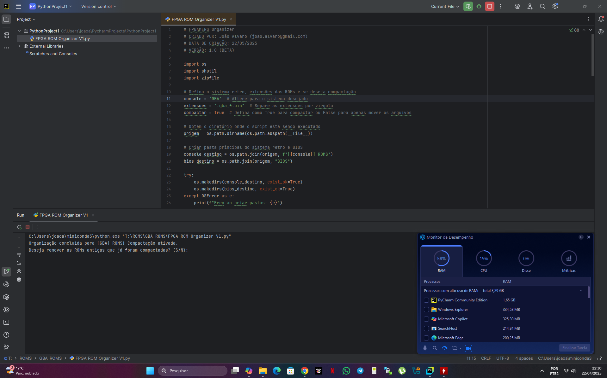

# FPGAMERS ROMS Organizer

## Descrição
Este script automatiza a organização de ROMs de diferentes consoles em uma estrutura de pastas organizada por ordem alfabética (A-Z) e numérica (0-9). Além disso, pode compactar as ROMs utilizando o método `deflate medium`, garantindo melhor compatibilidade com emuladores. A BIOS também é organizada seguindo a mesma estrutura.

## Funcionalidades
- Organiza ROMs em pastas de A-Z e 0-9 automaticamente.
- Organiza arquivos de BIOS na mesma estrutura das ROMs.
- Compacta ROMs no formato `.zip` com o método `deflate medium`.
- Gera um arquivo `.txt` listando todas as ROMs organizadas.
- Solicita confirmação antes de apagar ROMs antigas já compactadas.
- Exibe o tempo total de execução do script.

## Requisitos
- Python 3.x
- Módulo `shutil` (padrão no Python)
- Módulo `zipfile` (padrão no Python)

## Como Usar
1. **Baixe e salve o script** no diretório onde estão suas ROMs.
2. **Edite as configurações no início do script** conforme necessário:
   - `console`: Nome do console (exemplo: `"GBA"`).
   - `extensoes`: Extensões das ROMs a serem organizadas (exemplo: `".gba,*.bin"`).
   - `compactar`: `True` para compactar ou `False` para apenas mover arquivos.
3. **Execute o script** via terminal:
   ```sh
   python3 "FPGAGAMERS ROMS Organizer V1.2.py"

Eu uso e recomendo instalação pyCHarm Community e interpretador Python3



