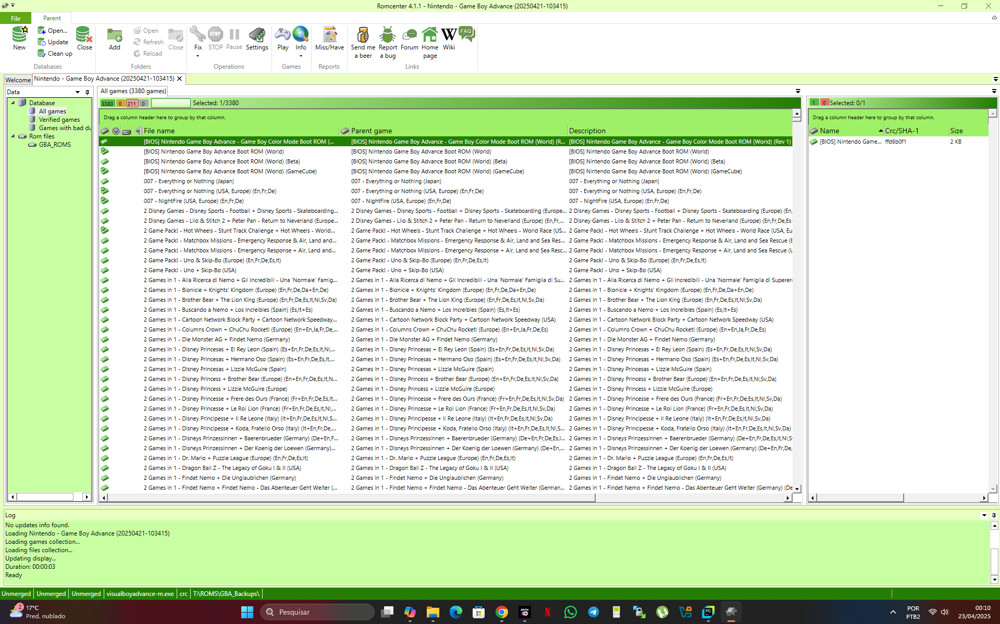
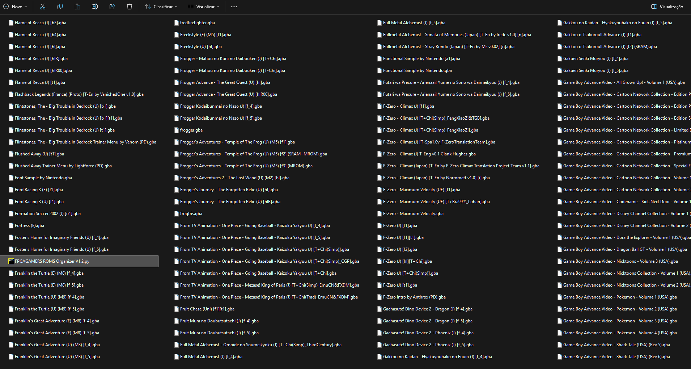
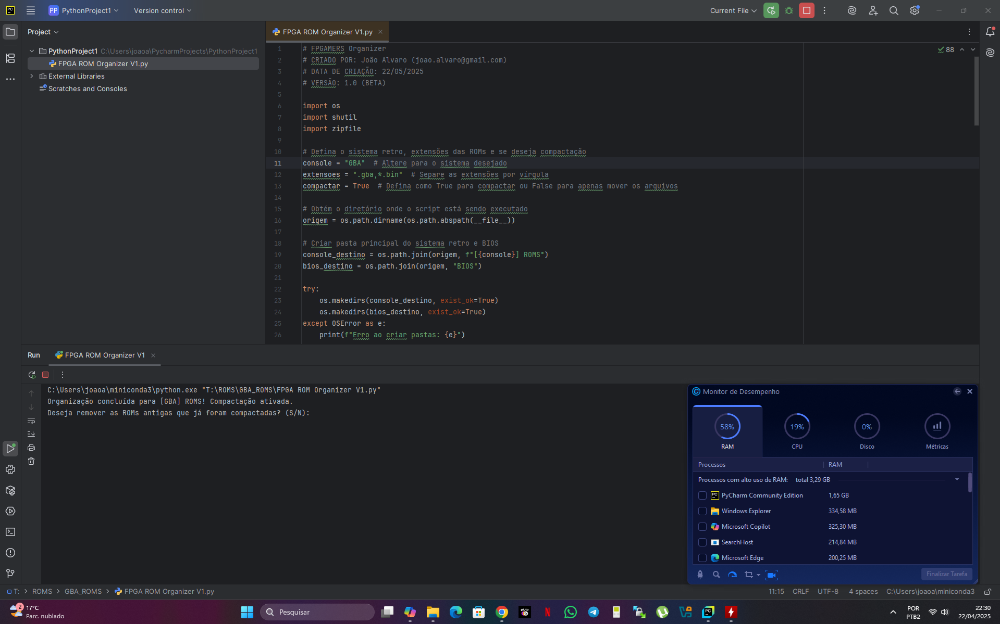
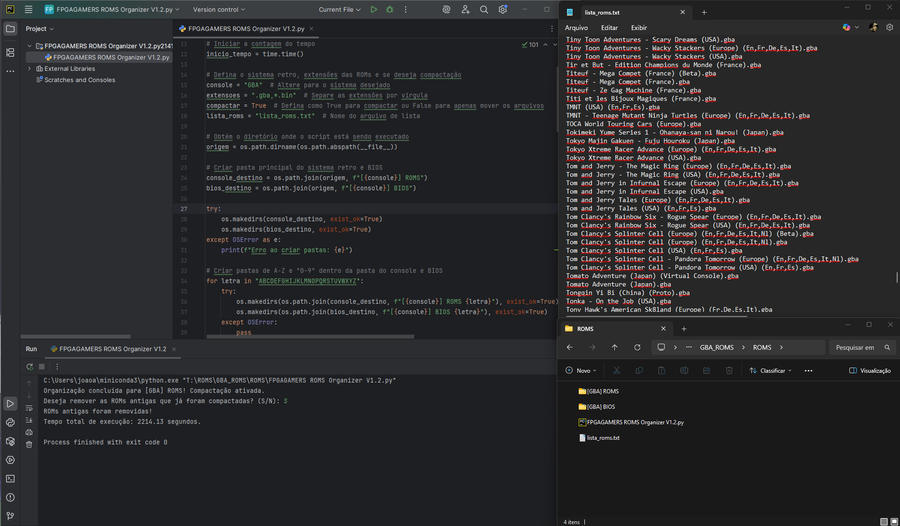
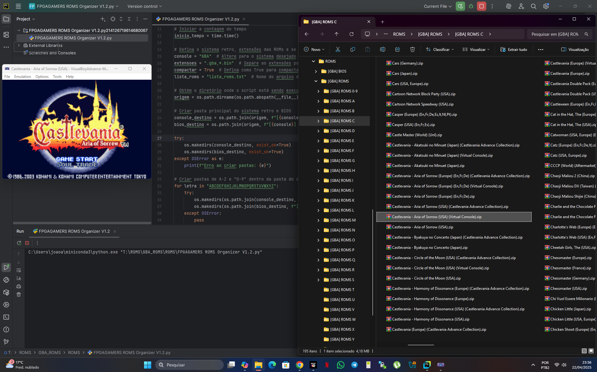

# FPGAMERS ROMS Organizer

## Descrição
Este script automatiza a organização de ROMs de diferentes consoles em uma estrutura de pastas organizada por ordem alfabética (A-Z) e numérica (0-9). Além disso, pode compactar as ROMs utilizando o método `deflate medium`, garantindo melhor compatibilidade com emuladores. A BIOS também é organizada seguindo a mesma estrutura.

## Funcionalidades
- Organiza ROMs em pastas de A-Z e 0-9 automaticamente.
- Organiza arquivos de BIOS na mesma estrutura das ROMs.
- Compacta ROMs no formato `.zip` com o método `deflate medium`.
- Gera um arquivo `.txt` listando todas as ROMs organizadas.
- Solicita confirmação antes de apagar ROMs antigas já compactadas.
- Exibe o tempo total de execução do script.

## Requisitos
- Python 3.x
- Módulo `shutil` (padrão no Python)
- Módulo `zipfile` (padrão no Python)

## Como Usar
1. **Baixe e salve o script** no diretório onde estão suas ROMs.
2. **Edite as configurações no início do script** conforme necessário:
   - `console`: Nome do console (exemplo: `"GBA"`).
   - `extensoes`: Extensões das ROMs a serem organizadas (exemplo: `".gba,*.bin"`).
   - `compactar`: `True` para compactar ou `False` para apenas mover arquivos.
3. **Execute o script** via terminal:
   ```sh
   python3 "FPGAGAMERS ROMS Organizer V1.2.py"

## Demonstração em 5 etapas.
Eu uso e recomendo instalação pyCharm Community e interpretador Python3 para execução do script: "FPGAMERS ROMS Organizer.py"

1- Opcional, mas recomendo usar Dat No-Intro e RomCenter para renomear as roms antes de executar o script.

Site Oficial para baixar os arquivos dat de cada console do Projeto No-Intro.
https://datomatic.no-intro.org/index.php?page=download&s=64

Site Oficial para baixar a ferramenta RomCenter.
https://www.romcenter.com/downloadpage/



2 - Certifique de extrair todas as roms usando 7zip ou Winrar em uma pasta.


3 - Eu uso e recomendo instalação pyCharm Community e interpretador Python3, após instalar, baixe o script na pasta de roms e de um duplo clique no script.
Ajuste o nome do console e extenssão dos arquivos, salve as alterações e clique em Run para executar o script: "FPGAMERS ROMS Organizer.py", conforme imagem abaixo:


4 - Acompanhe a excução no terminal do python, no final deve gerar uma lista com as roms.


5 - Resultado final pasta de Roms organizadas, roms organizadas em ordem alfabetica e compactadas em um formato compativel com a maioria dos emuladores e sistemas FPGA.


Considere ajudar apoiando!
João Alvaro - Chave Pix: joao.alvaro@gmail.com

BOM DIVERTIMENTO!
